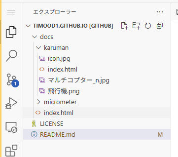
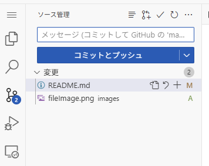

# micrometer

# Karuman 更新方法
1. https://github.com/timood1/timood1.github.io を開く
2. "." ドットキーを押す
3. WebでVscode が開かれるので /docs/karuman を開く
    
4. ファイルを編集する
5. この画面を開き 変更内容の説明をメッセージに入れる
    
6. コミットとプッシュを押す
7. 数分から数十分まつ
8. https://timood1.github.io/ を確認する